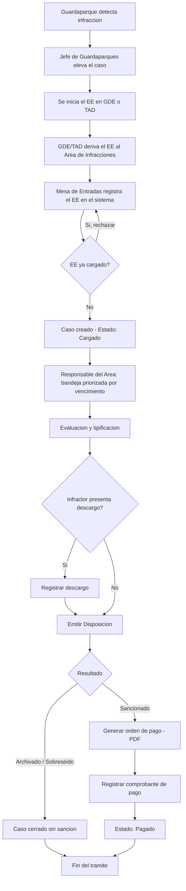

# Infracciones Lanín — Especificación funcional y técnica

Sistema web interno para el Área de Infracciones del Parque Nacional Lanín (Administración de Parques Nacionales).

---

## 1. Resumen ejecutivo

El sistema gestiona el ciclo administrativo y legal de un expediente de infracción desde que es **derivado desde GDE o TAD** hacia el Área de Infracciones, hasta que se emite la **Disposición** y, si corresponde, la **orden de pago** de la multa. No reemplaza a GDE/TAD ni captura infracciones en campo: es un sistema de seguimiento y gestión que referencia el Expediente Electrónico (EE) oficial.

## 2. Objetivos principales

1. Registrar de forma trazable cada EE derivado al área, evitando pérdida de casos y cargas duplicadas.
2. Permitir evaluar, tipificar y resolver cada caso dentro de los plazos legales, con alertas de vencimiento.
3. Generar automáticamente la orden de pago cuando corresponde sanción, y dejar constancia de su conciliación.

## 3. Flujo completo del trámite

```
Guardaparque detecta la infracción
        │
        ▼
Jefe de Guardaparques eleva el caso
        │
        ▼
Se inicia el Expediente Electrónico (EE) en GDE o TAD
        │
        ▼
GDE/TAD deriva el EE al Área de Infracciones
        │
        ▼
Mesa de Entradas registra el EE en Infracciones Lanín
        │
        ▼
Responsable del Área evalúa y tipifica (con descargo, si corresponde)
        │
        ▼
Emite la Disposición (Sancionado / Archivado / Sobreseído)
        │
        ├─ Sancionado → genera orden de pago (PDF) → se concilia el pago al recibir comprobante
        └─ Archivado / Sobreseído → caso cerrado
```

### Diagrama (Mermaid)



## 4. Roles y sitemap

### Mesa de Entradas
| Vista | Contenido |
|---|---|
| Dashboard | Casos recientes, alertas de duplicado, resumen de carga |
| Registrar EE recibido | N° de EE (único, formato `EX-AAAA-NNNNNNNN- -SIGLA-SIGLA#SIGLA`), repartición (`DGA#APNAC` / `DGAJ#APNAC` / `DC#APNAC` / Otra), origen derivado automático (GDE o TAD), datos del infractor, tipo de infracción, fecha de la infracción, sector del parque, guardaparque interviniente, Jefe de Guardaparques que elevó, adjuntos |
| Buscador / Listado de casos | Filtros combinables: estado, tipo de infracción, repartición/origen, rango de fecha de la infracción, rango de fecha de recepción del EE (independiente del anterior), texto libre (N° EE, N° Disposición, infractor) |
| Detalle de caso | Datos, adjuntos, historial cronológico inmutable, botón "Registrar pago" cuando aplica |

### Responsable del Área (de Infracciones)
| Vista | Contenido |
|---|---|
| Dashboard | Bandeja priorizada por proximidad de vencimiento (semáforo rojo/ámbar/verde) |
| Evaluación de caso | Tipificación según catálogo normativo, monto sugerido/editable dentro de rango, dictamen, adjuntar descargo del infractor |
| Emitir Disposición | N° de Disposición, resultado (Sancionado / Archivado / Sobreseído) — dispara la orden de pago si corresponde |
| Histórico / Buscador | Mismo buscador con filtros que Mesa de Entradas, sobre casos resueltos |
| Reportes | Infracciones por tipo, período, sector, repartición/origen, montos generados y cobrados |

### Administrador
- Gestión de usuarios y asignación de rol
- Catálogo de tipos de infracción, montos y reparticiones válidas
- Configuración de plazos legales (días para descargo, días de alerta previa)
- Importador de `.xlsx` para migración inicial del historial
- Auditoría (log inmutable de cambios por caso)

## 5. Requerimientos funcionales por módulo

**Auth** — interno, sin registro público ni OAuth social. Alta de usuarios por Administrador con rol asignado. Login usuario/contraseña, recuperación por email institucional, bloqueo tras 5 intentos fallidos. Preparado para SSO institucional futuro.

**Registro de EE (Mesa de Entradas)** — el N° de EE es clave única: no se puede cargar dos veces el mismo. Validación de formato flexible (no regex rígido, dado que no hay especificación oficial confirmada de todas las variantes) + normalización (mayúsculas, sin espacios extra) antes de chequear duplicados. Repartición como desplegable con las 3 opciones conocidas más "Otra" a texto libre.

**Evaluación y Disposición (Responsable del Área)** — máquina de estados: `Cargado → En evaluación → (Con descargo presentado) → Resuelto (Sancionado | Archivado | Sobreseído) → (Con orden de pago) → Pagado`. Contador de plazo legal parametrizable desde que el caso entra en evaluación, con alerta a N días de vencer. El monto de la multa se ajusta dentro del rango definido por el catálogo, no fuera de él.

**Orden de pago** — sin pasarela de cobro online. Al emitir Disposición "Sancionado" se genera automáticamente el PDF con monto, N° de EE y N° de Disposición. Cualquiera de los dos roles puede cargar el comprobante recibido y marcar el caso como Pagado, quedando registrado usuario y fecha.

**Buscador** — filtros combinables en simultáneo: estado, tipo de infracción, repartición/origen, rango de fecha de la infracción, rango de fecha de recepción del EE (ambas fechas independientes entre sí), texto libre.

**Importador .xlsx** — uso pensado para la migración inicial del historial (no para el flujo diario). Valida columnas requeridas, usa el N° de EE como clave única, y reporta filas no procesables con el motivo del error.

**Notificaciones** — Fase 1: alertas visibles en el dashboard. Fase 2: email automático de vencimiento de plazo y de nuevo caso en bandeja.

## 6. Requerimientos no funcionales y stack

| Capa | Recomendación |
|---|---|
| Frontend | Next.js (App Router) + TypeScript + Tailwind CSS |
| Backend | Next.js monolito (Server Actions / API routes) — volumen no justifica microservicios |
| Base de datos | PostgreSQL + Prisma |
| Adjuntos | S3-compatible o storage local, según defina sistemas de APN |
| PDF | Puppeteer o pdf-lib |
| Infraestructura | **On-premise**, empaquetado en Docker — lo despliega y mantiene el área de sistemas de APN |
| Seguridad | TLS en tránsito, cifrado en reposo, RBAC estricto, logs de auditoría inmutables, cumplimiento de la Ley 25.326 de Protección de Datos Personales |

## 7. UX/UI

Estética institucional, sobria — verde institucional de línea APN como color primario, grises neutros, semáforo rojo/ámbar/verde para estados de vencimiento. Sin modo oscuro en el MVP. Accesibilidad WCAG AA (contraste alto, tipografía ≥14px, navegación por teclado en formularios largos).

## 8. Historias de usuario (MVP)

**US1 — Registrar EE derivado**
Dado que Mesa de Entradas recibe la notificación de derivación de un EE, cuando ingresa el N° de EE, la repartición, los datos del infractor y de la infracción, y confirma, entonces el sistema crea un caso en estado `Cargado`, visible en la bandeja del Responsable del Área — salvo que el N° de EE ya exista, en cuyo caso rechaza la carga.

**US2 — Rechazo de EE duplicado**
Dado que se intenta registrar un EE, cuando el N° de EE normalizado ya existe en el sistema, entonces la carga se rechaza con un mensaje indicando el caso existente.

**US3 — Bandeja priorizada por vencimiento**
Dado que tengo casos en `Cargado` o `En evaluación`, cuando ingreso a mi bandeja como Responsable del Área, entonces los veo ordenados por proximidad de vencimiento del plazo legal, con indicador rojo/ámbar/verde.

**US4 — Tipificar y determinar sanción**
Dado que estoy evaluando un caso, cuando selecciono el tipo de infracción del catálogo, entonces el sistema sugiere el rango de multa correspondiente y puedo ajustar el monto dentro de ese rango.

**US5 — Registrar descargo**
Dado que un caso está dentro del plazo de descargo, cuando adjunto el documento presentado por el infractor, entonces el caso pasa a `Con descargo presentado` y se registra la fecha para control del plazo.

**US6 — Emitir Disposición**
Dado que finalicé la evaluación, cuando registro el N° de Disposición y selecciono el resultado (Sancionado / Archivado / Sobreseído), entonces el caso pasa a `Resuelto` y, si es Sancionado, se genera automáticamente la orden de pago en PDF.

**US7 — Conciliar pago**
Dado que un caso tiene orden de pago pendiente, cuando cargo el comprobante recibido y confirmo, entonces el caso pasa a `Pagado`, con usuario y fecha de conciliación registrados.

**US8 — Historial inmutable**
Dado que abro el detalle de un caso, cuando reviso su historial, entonces veo todos los cambios de estado con usuario y fecha en orden cronológico, sin posibilidad de edición retroactiva.

**US9 — Acceso por rol**
Dado que soy un usuario con rol Mesa de Entradas o Responsable del Área, cuando inicio sesión, entonces solo accedo a las vistas y acciones habilitadas para mi rol.

**US10 — Alerta de vencimiento**
Dado que un caso tiene un plazo legal configurado, cuando faltan N días para su vencimiento sin resolución, entonces se destaca en el dashboard del responsable (Fase 2: además, email automático).

**US11 — Buscar con filtros combinados**
Dado que estoy en el listado de casos, cuando aplico uno o más filtros (estado, tipo de infracción, repartición/origen, rango de fecha de la infracción, rango de fecha de recepción del EE, texto libre), entonces el sistema muestra solo los casos que cumplen todos los filtros aplicados, evaluando ambas fechas de forma independiente.

**US12 — Migrar historial desde xlsx**
Dado que soy Administrador y tengo un archivo `.xlsx` con infracciones previas al sistema, cuando lo cargo en el importador, entonces el sistema valida las columnas, crea un caso por cada fila válida (usando el N° de EE como clave única) y reporta las filas no procesadas con el motivo del error.

## 9. Plan de desarrollo por fases

**Fase 1 — MVP**
- Auth con roles (Mesa de Entradas, Responsable del Área, Administrador)
- Registro de EE con validación y unicidad
- Catálogo parametrizable de infracciones, montos y reparticiones
- Buscador con filtros combinados
- Evaluación, descargos, emisión de Disposición
- Generación automática de orden de pago en PDF y conciliación manual
- Historial/auditoría inmutable por caso
- Importador `.xlsx` para migrar el historial existente
- Alertas de vencimiento en dashboard

**Fase 2 — Consolidación**
- Notificaciones automáticas por email
- Reportes y estadísticas (por tipo, período, sector, repartición)
- Auditoría exportable y dashboard con KPIs
- Catálogo de infracciones totalmente autogestionable

**Fase 3 — Escalabilidad**
- Integración por API con GDE (sujeta a que sistemas de APN otorgue acceso)
- Portal de consulta para el infractor
- Pasarela de pago online
- Registro en campo para guardaparques, si se decide ampliar el alcance
- SSO institucional

---

*Puntos abiertos a confirmar antes de codear: catálogo real de tipos de infracción y montos vigentes; plazos legales exactos (días de descargo, prescripción); definición final de storage de adjuntos (S3 vs. local) según lo que determine el área de sistemas de APN para el despliegue on-premise.*
